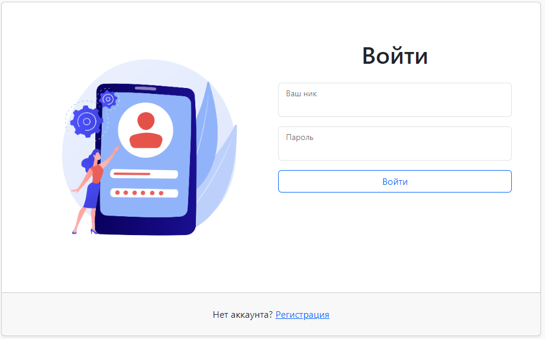
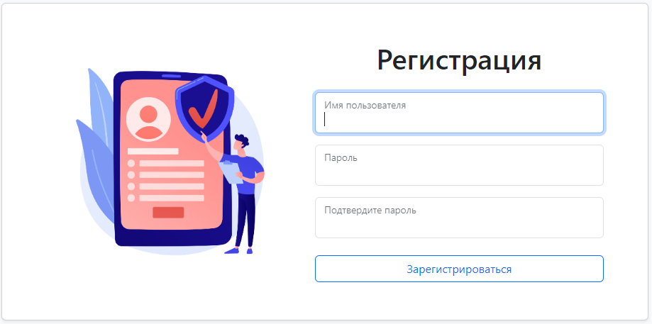
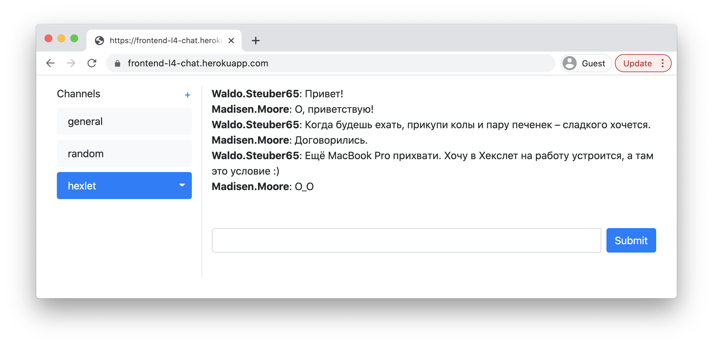
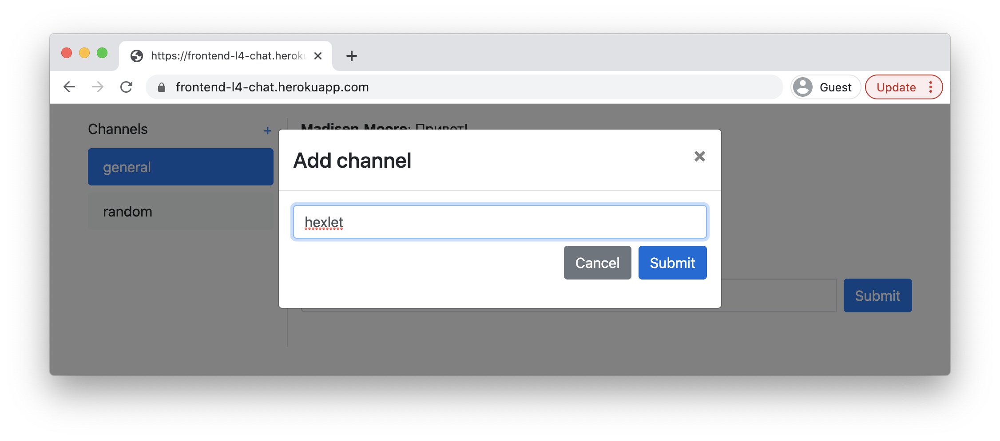

# [Чат (Slack)](https://hexlet-chat-2wfk.onrender.com)

Данный чат представляет собой очень упрощенную версию Slack-чата. Есть возможность создания аккаунта, создание, удаление и переименование каналов

### Hexlet tests and linter status:
[](https://github.com/IvanSH-Jr/frontend-project-12/actions)

### CodeClimate
[](https://codeclimate.com/github/IvanSH-Jr/frontend-project-12/maintainability)

## Установка

```
//Установка всех зависимостей
make install
```

```
//Запуск приложения
make start
```

## Использование

Если уже есть аккаунт, то достаточно ввести свои данные в форму входа



Если аккаунта нет, то кликните по сслыке регистрации внизу и создайте аккаунт



Отправляйте сообщения в каналах чата, создавайте новые!



